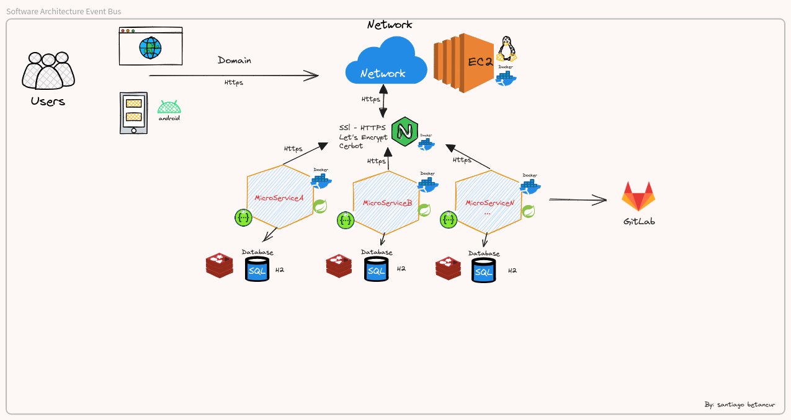
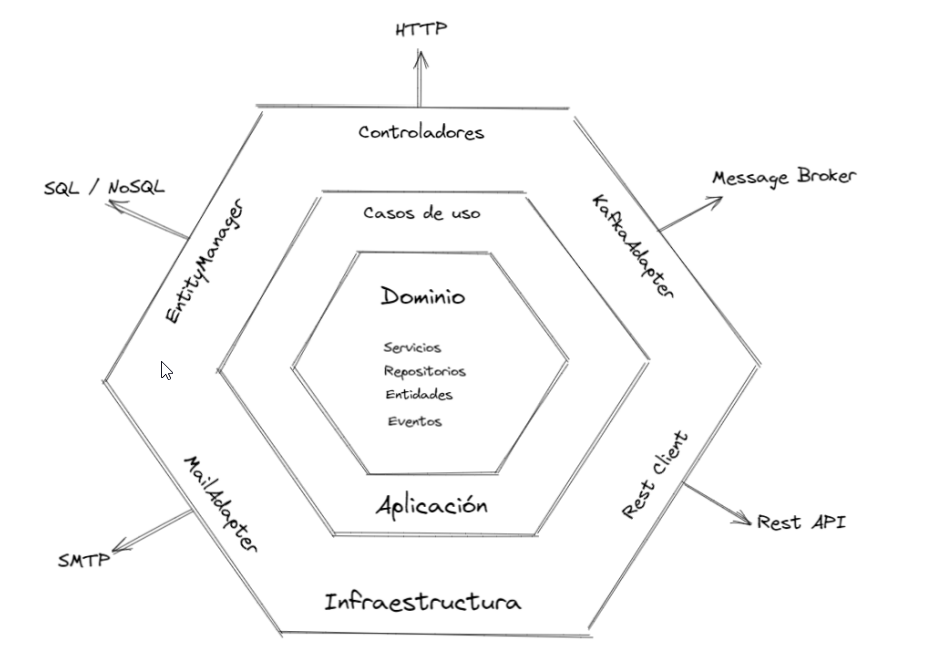
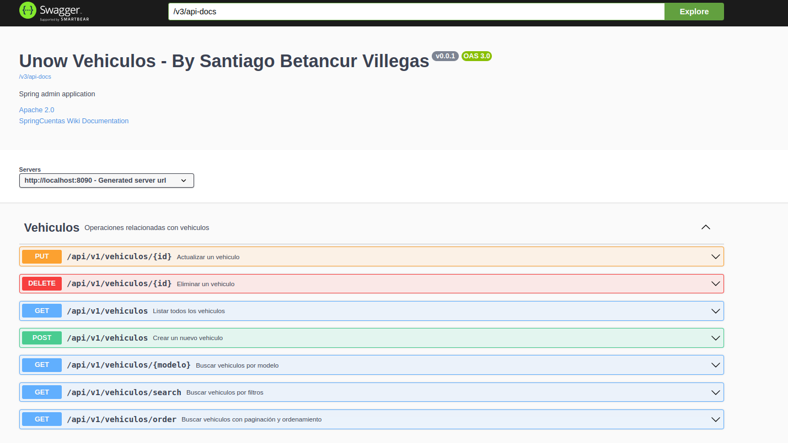

# servicio-vehiculo

Microservicio de vehiculo

# Definicion de la Arquitectura principal para comunicación de Microservicio

Microservicio de vehiculo con una arquitectura hexagonal

Endpoint del Microservicio de vehiculos

Para iniciar estos pasos tener la imágen docker:

## Probar con comandos docker

## Realizar el pull de este micro cliente en la versión latest:

- docker pull santbetv/microservicio-vehiculo:latest

### Tambien se puede probar en un ambiente local desde:

### Url GitHub
- https://github.com/santbetv/vehicle-management-project.git

El proyecto corre sobre un db H2 para probar más rápido, pero también se adjunta
SQL para probar en db postgreSQL.

### Url swagger

- http://localhost:8090/api/swagger-ui/index.html
